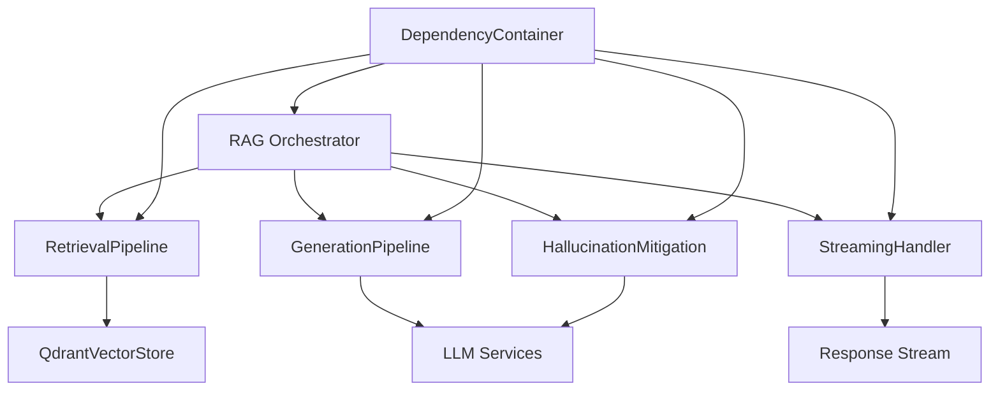
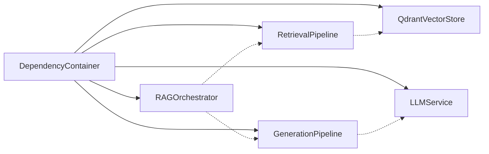
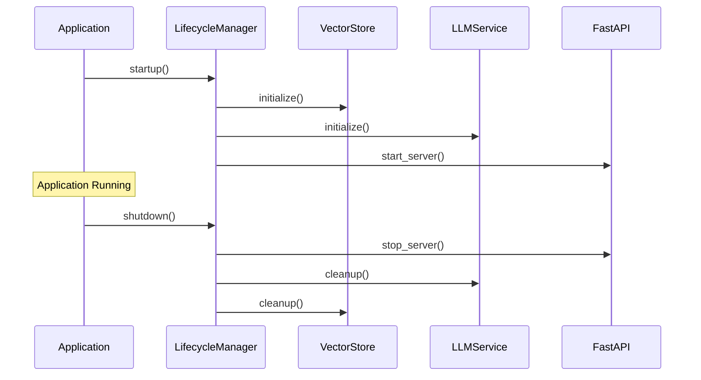

# Design Document: RAG Orchestrator Clean Architecture Improvements

## Overview

This design addresses critical architectural improvements to the RAG orchestrator system while maintaining its existing clean architecture foundation. The improvements focus on fixing a critical HTTP implementation bug, refactoring monolithic components into focused classes following Single Responsibility Principle, replacing service locator anti-pattern with explicit dependency injection, and enhancing production robustness through proper lifecycle management, error handling, and comprehensive testing strategies.

The design maintains the existing three-layer clean architecture (domain/application/infrastructure) while introducing focused pipeline components, explicit dependency management, and resilience patterns. All improvements are designed to enhance maintainability, testability, and production reliability without disrupting the current architectural boundaries.

## Architecture

### Current Architecture Overview
The system follows clean architecture with three distinct layers:
- **Domain Layer**: Core business logic and entities
- **Application Layer**: Use cases and orchestration logic  
- **Infrastructure Layer**: External integrations (FastAPI, Qdrant, LLM services)

### Proposed Architecture Improvements

#### Pipeline Component Architecture
The monolithic `AdvancedRAGChain` will be decomposed into four focused pipeline components:



#### Dependency Injection Architecture
Replace service locator pattern with explicit constructor-based dependency injection:



#### Lifecycle Management Architecture
Implement proper service lifecycle with startup/shutdown hooks:



## Components and Interfaces

### Core Pipeline Components

#### RetrievalPipeline
Handles all document retrieval strategies independently from generation logic.

```python
from abc import ABC, abstractmethod
from typing import List, Dict, Any
from dataclasses import dataclass

@dataclass
class RetrievalResult:
    documents: List[Dict[str, Any]]
    scores: List[float]
    metadata: Dict[str, Any]

class RetrievalStrategy(ABC):
    @abstractmethod
    async def retrieve(self, query: str, limit: int) -> RetrievalResult:
        pass

class RetrievalPipeline:
    def __init__(self, vector_store: VectorStore, strategies: List[RetrievalStrategy]):
        self._vector_store = vector_store
        self._strategies = strategies
    
    async def retrieve_documents(self, query: str, strategy_name: str) -> RetrievalResult:
        strategy = self._get_strategy(strategy_name)
        return await strategy.retrieve(query, limit=10)
```

#### GenerationPipeline
Manages LLM generation with citation tracking independently from retrieval logic.

```python
@dataclass
class GenerationResult:
    response: str
    citations: List[Dict[str, Any]]
    confidence_score: float
    metadata: Dict[str, Any]

class GenerationPipeline:
    def __init__(self, llm_service: LLMService, citation_tracker: CitationTracker):
        self._llm_service = llm_service
        self._citation_tracker = citation_tracker
    
    async def generate_response(self, query: str, context: RetrievalResult) -> GenerationResult:
        prompt = self._build_prompt(query, context.documents)
        response = await self._llm_service.generate(prompt)
        citations = self._citation_tracker.extract_citations(response, context.documents)
        return GenerationResult(response, citations, 0.85, {})
```

#### HallucinationMitigation
Performs verification and self-reflection independently from other pipeline stages.

```python
@dataclass
class VerificationResult:
    is_hallucination: bool
    confidence_score: float
    evidence: List[str]
    corrected_response: str = None

class HallucinationMitigation:
    def __init__(self, llm_service: LLMService, fact_checker: FactChecker):
        self._llm_service = llm_service
        self._fact_checker = fact_checker
    
    async def verify_response(self, response: GenerationResult, context: RetrievalResult) -> VerificationResult:
        fact_check_result = await self._fact_checker.verify_facts(response.response, context.documents)
        if fact_check_result.has_hallucination:
            corrected = await self._self_reflect_and_correct(response, context)
            return VerificationResult(True, fact_check_result.confidence, fact_check_result.evidence, corrected)
        return VerificationResult(False, fact_check_result.confidence, fact_check_result.evidence)
```

#### StreamingHandler
Manages streaming responses independently from generation logic.

```python
from typing import AsyncGenerator

class StreamingHandler:
    def __init__(self, buffer_size: int = 1024):
        self._buffer_size = buffer_size
    
    async def stream_response(self, generation_result: GenerationResult) -> AsyncGenerator[str, None]:
        response_chunks = self._chunk_response(generation_result.response)
        for chunk in response_chunks:
            yield chunk
            await asyncio.sleep(0.01)  # Prevent overwhelming client
```

### Fixed QdrantVectorStore Implementation

#### HTTP Transport Fix
Address the critical HTTP fallback bug in the `_do_search()` method:

```python
class QdrantVectorStore:
    def __init__(self, client: QdrantClient, collection_name: str):
        self._client = client
        self._collection_name = collection_name
        self._transport_type = self._detect_transport_type()
    
    def _detect_transport_type(self) -> str:
        """Detect whether client uses gRPC or HTTP transport"""
        if hasattr(self._client, '_channel') and self._client._channel:
            return "grpc"
        return "http"
    
    async def _do_search(self, query_vector: List[float], limit: int) -> List[ScoredPoint]:
        """Fixed implementation with proper HTTP fallback handling"""
        try:
            if self._transport_type == "grpc":
                return await self._search_grpc(query_vector, limit)
            else:
                return await self._search_http(query_vector, limit)
        except Exception as e:
            if self._transport_type == "grpc":
                # Fallback to HTTP if gRPC fails
                logger.warning(f"gRPC search failed, falling back to HTTP: {e}")
                return await self._search_http(query_vector, limit)
            else:
                # HTTP is already the fallback, re-raise with context
                raise QdrantSearchError(f"HTTP search failed: {e}") from e
    
    async def _search_http(self, query_vector: List[float], limit: int) -> List[ScoredPoint]:
        """Properly implemented HTTP search with validation"""
        if not self._validate_http_connection():
            raise QdrantConnectionError("HTTP connection validation failed")
        
        search_request = SearchRequest(
            vector=query_vector,
            limit=limit,
            with_payload=True
        )
        
        return await self._client.search(
            collection_name=self._collection_name,
            **search_request.dict()
        )
```

### Dependency Injection Container

#### Explicit DI Implementation
Replace service locator with constructor-based dependency injection:

```python
from typing import TypeVar, Type, Dict, Any, Callable
from dataclasses import dataclass

T = TypeVar('T')

@dataclass
class ServiceDefinition:
    factory: Callable[..., Any]
    singleton: bool = True
    dependencies: List[str] = None

class DependencyContainer:
    def __init__(self):
        self._services: Dict[str, ServiceDefinition] = {}
        self._instances: Dict[str, Any] = {}
        self._dependency_graph: Dict[str, List[str]] = {}
    
    def register(self, name: str, factory: Callable[..., T], 
                singleton: bool = True, dependencies: List[str] = None) -> None:
        """Register a service with explicit dependencies"""
        self._services[name] = ServiceDefinition(factory, singleton, dependencies or [])
        self._dependency_graph[name] = dependencies or []
        self._validate_dependency_graph()
    
    def resolve(self, name: str) -> Any:
        """Resolve service with all its dependencies"""
        if name in self._instances and self._services[name].singleton:
            return self._instances[name]
        
        service_def = self._services[name]
        resolved_deps = [self.resolve(dep) for dep in service_def.dependencies]
        
        instance = service_def.factory(*resolved_deps)
        
        if service_def.singleton:
            self._instances[name] = instance
        
        return instance
    
    def _validate_dependency_graph(self) -> None:
        """Validate no circular dependencies exist"""
        visited = set()
        rec_stack = set()
        
        def has_cycle(node: str) -> bool:
            visited.add(node)
            rec_stack.add(node)
            
            for neighbor in self._dependency_graph.get(node, []):
                if neighbor not in visited:
                    if has_cycle(neighbor):
                        return True
                elif neighbor in rec_stack:
                    return True
            
            rec_stack.remove(node)
            return False
        
        for service in self._services:
            if service not in visited:
                if has_cycle(service):
                    raise DependencyError(f"Circular dependency detected involving {service}")
```

### Lifecycle Management System

#### Service Lifecycle Manager
Implement proper startup/shutdown with resource cleanup:

```python
from enum import Enum
from typing import List, Protocol

class ServiceState(Enum):
    STOPPED = "stopped"
    STARTING = "starting"
    RUNNING = "running"
    STOPPING = "stopping"
    FAILED = "failed"

class ManagedService(Protocol):
    async def startup(self) -> None: ...
    async def shutdown(self) -> None: ...
    async def health_check(self) -> bool: ...

class LifecycleManager:
    def __init__(self, container: DependencyContainer):
        self._container = container
        self._services: List[ManagedService] = []
        self._state = ServiceState.STOPPED
        self._startup_order: List[str] = []
    
    def register_service(self, name: str, service: ManagedService, depends_on: List[str] = None) -> None:
        """Register a service with lifecycle management"""
        self._services.append(service)
        self._container.register(name, lambda: service, dependencies=depends_on)
    
    async def startup_all(self) -> None:
        """Start all services in dependency order"""
        self._state = ServiceState.STARTING
        startup_order = self._calculate_startup_order()
        
        try:
            for service_name in startup_order:
                service = self._container.resolve(service_name)
                await service.startup()
                logger.info(f"Started service: {service_name}")
            
            self._state = ServiceState.RUNNING
            logger.info("All services started successfully")
            
        except Exception as e:
            self._state = ServiceState.FAILED
            logger.error(f"Service startup failed: {e}")
            await self.shutdown_all()  # Cleanup on failure
            raise
    
    async def shutdown_all(self) -> None:
        """Shutdown all services in reverse dependency order"""
        self._state = ServiceState.STOPPING
        shutdown_order = list(reversed(self._startup_order))
        
        for service_name in shutdown_order:
            try:
                service = self._container.resolve(service_name)
                await service.shutdown()
                logger.info(f"Stopped service: {service_name}")
            except Exception as e:
                logger.error(f"Error stopping service {service_name}: {e}")
                # Continue shutdown of other services
        
        self._state = ServiceState.STOPPED
        logger.info("All services stopped")
```

## Data Models

### Enhanced Error Handling Models

```python
from enum import Enum
from dataclasses import dataclass
from typing import Optional, Dict, Any, List

class ErrorType(Enum):
    TRANSIENT = "transient"
    PERMANENT = "permanent"
    RATE_LIMITED = "rate_limited"
    AUTHENTICATION = "authentication"
    VALIDATION = "validation"

@dataclass
class RetryConfig:
    max_attempts: int = 3
    base_delay: float = 1.0
    max_delay: float = 60.0
    exponential_base: float = 2.0
    jitter: bool = True

@dataclass
class ErrorContext:
    error_type: ErrorType
    retry_config: RetryConfig
    attempt_count: int = 0
    last_error: Optional[Exception] = None
    metadata: Dict[str, Any] = None

class CircuitBreakerState(Enum):
    CLOSED = "closed"
    OPEN = "open"
    HALF_OPEN = "half_open"

@dataclass
class CircuitBreakerConfig:
    failure_threshold: int = 5
    recovery_timeout: float = 60.0
    success_threshold: int = 3
```

### Request Validation Models

```python
from pydantic import BaseModel, validator
from typing import Optional, Dict, Any

class RAGRequest(BaseModel):
    query: str
    max_results: int = 10
    strategy: str = "default"
    session_id: Optional[str] = None
    metadata: Dict[str, Any] = {}
    
    @validator('query')
    def validate_query(cls, v):
        if not v or not v.strip():
            raise ValueError('Query cannot be empty')
        if len(v) > 1000:
            raise ValueError('Query too long (max 1000 characters)')
        # Sanitize potential injection attempts
        dangerous_patterns = ['<script', 'javascript:', 'data:', 'vbscript:']
        v_lower = v.lower()
        if any(pattern in v_lower for pattern in dangerous_patterns):
            raise ValueError('Query contains potentially dangerous content')
        return v.strip()
    
    @validator('max_results')
    def validate_max_results(cls, v):
        if v < 1 or v > 100:
            raise ValueError('max_results must be between 1 and 100')
        return v

class RateLimitConfig(BaseModel):
    requests_per_minute: int = 60
    requests_per_hour: int = 1000
    burst_limit: int = 10
```

## Correctness Properties

*A property is a characteristic or behavior that should hold true across all valid executions of a system—essentially, a formal statement about what the system should do. Properties serve as the bridge between human-readable specifications and machine-verifiable correctness guarantees.*

Now I need to use the prework tool to analyze the acceptance criteria before writing the correctness properties:

### HTTP Transport Properties

Property 1: HTTP search operations complete successfully
*For any* valid query vector and search parameters, when QdrantVectorStore uses HTTP transport, the search operation should complete without runtime exceptions
**Validates: Requirements 1.1**

Property 2: Transport method equivalence
*For any* search query, the results from HTTP transport should be structurally equivalent to gRPC transport results (same format, comparable scores)
**Validates: Requirements 1.2**

Property 3: Transport consistency
*For any* search query executed with both transport methods, the search result accuracy and ranking should remain consistent within acceptable tolerance
**Validates: Requirements 1.3**

Property 4: HTTP error context
*For any* HTTP transport failure, the error message should contain transport-specific context information and be descriptive enough for debugging
**Validates: Requirements 1.4**

Property 5: HTTP connection validation
*For any* invalid HTTP connection parameters, the validation should fail before attempting search operations
**Validates: Requirements 1.5**

### Pipeline Architecture Properties

Property 6: Retrieval pipeline independence
*For any* retrieval request, the RetrievalPipeline should function correctly without any generation components being initialized or available
**Validates: Requirements 2.1**

Property 7: Generation pipeline independence
*For any* generation request with mock retrieval results, the GenerationPipeline should function correctly without actual retrieval components
**Validates: Requirements 2.2**

Property 8: Hallucination mitigation independence
*For any* verification request with mock generation results, the HallucinationMitigation should function correctly without other pipeline components
**Validates: Requirements 2.3**

Property 9: Streaming handler independence
*For any* streaming request with mock generation results, the StreamingHandler should function correctly without generation components
**Validates: Requirements 2.4**

Property 10: Orchestrator interface coordination
*For any* RAG request, the orchestrator should successfully coordinate pipeline components through their defined interfaces using mock implementations
**Validates: Requirements 2.6**

### Dependency Injection Properties

Property 11: Constructor dependency provision
*For any* component requiring dependencies, construction should fail with clear error messages when required dependencies are not provided
**Validates: Requirements 3.2**

Property 12: Dependency graph validation
*For any* dependency configuration with circular dependencies, the system should detect and prevent startup with descriptive error messages
**Validates: Requirements 3.6**

### Lifecycle Management Properties

Property 13: Service startup ordering
*For any* set of services with dependencies, the LifecycleManager should initialize services in correct dependency order (dependencies before dependents)
**Validates: Requirements 4.1**

Property 14: Service shutdown ordering
*For any* set of running services, the LifecycleManager should cleanup services in reverse dependency order (dependents before dependencies)
**Validates: Requirements 4.2**

Property 15: Startup failure handling
*For any* service that fails during startup, the LifecycleManager should prevent system startup and report the specific failure
**Validates: Requirements 4.3**

Property 16: Graceful shutdown completion
*For any* in-flight requests during shutdown initiation, the LifecycleManager should allow request completion before resource cleanup
**Validates: Requirements 4.4**

Property 17: Health check accuracy
*For any* service state change, the health check endpoints should accurately reflect the actual service readiness status
**Validates: Requirements 4.5**

Property 18: Cleanup error resilience
*For any* resource cleanup failure, the LifecycleManager should log detailed error information and continue cleanup of remaining resources
**Validates: Requirements 4.6**

### Error Recovery Properties

Property 19: Exponential backoff retry pattern
*For any* external service failure, the retry delays should follow exponential backoff pattern with configurable base delay, multiplier, and maximum delay
**Validates: Requirements 5.1**

Property 20: Fallback activation
*For any* primary service unavailability, the ErrorRecovery should activate appropriate fallback strategies to maintain system availability
**Validates: Requirements 5.2**

Property 21: Retry exhaustion messaging
*For any* retry sequence that reaches maximum attempts, the error message should contain context about all attempted recovery strategies
**Validates: Requirements 5.3**

Property 22: Error type classification
*For any* error condition, the ErrorRecovery should correctly classify errors as retryable or non-retryable and handle them appropriately
**Validates: Requirements 5.4**

Property 23: Circuit breaker behavior
*For any* service that exceeds failure thresholds, the circuit breaker should open and provide fallback responses until recovery conditions are met
**Validates: Requirements 5.5**

Property 24: Recovery operation logging
*For any* retry attempt or fallback activation, the system should log detailed information for monitoring and debugging purposes
**Validates: Requirements 5.6**

### Request Validation Properties

Property 25: Input sanitization
*For any* request containing potentially malicious input patterns, the RequestValidator should sanitize or reject the input to prevent injection attacks
**Validates: Requirements 6.1**

Property 26: Schema validation
*For any* query that violates defined schemas, the RequestValidator should reject it with appropriate validation error messages
**Validates: Requirements 6.2**

Property 27: Rate limiting enforcement
*For any* session that exceeds configured rate limits, subsequent requests should be rejected with appropriate HTTP status codes
**Validates: Requirements 6.3**

Property 28: Size limit validation
*For any* request exceeding configured size limits, the RequestValidator should reject it to prevent resource exhaustion
**Validates: Requirements 6.4**

Property 29: Security event logging
*For any* malformed or suspicious request, the RequestValidator should log security events and return standardized error responses
**Validates: Requirements 6.5**

Property 30: Configurable rate limiting
*For any* endpoint and session combination, rate limiting should be enforced independently according to configured rules
**Validates: Requirements 6.6**

### Data Integrity Properties

Property 31: Data transformation round-trip
*For any* data object that undergoes serialization and deserialization, the resulting object should be equivalent to the original
**Validates: Requirements 7.2**

Property 32: Operation relationship consistency
*For any* pair of related system operations, the metamorphic relationships between their results should remain consistent
**Validates: Requirements 7.7**

## Error Handling

### Resilience Patterns Implementation

#### Retry Logic with Exponential Backoff
The system implements sophisticated retry mechanisms using the Tenacity library with exponential backoff and jitter:

```python
from tenacity import retry, stop_after_attempt, wait_exponential, retry_if_exception_type
import random

class ErrorRecoveryService:
    def __init__(self, config: RetryConfig):
        self._config = config
    
    @retry(
        stop=stop_after_attempt(3),
        wait=wait_exponential(multiplier=1, min=1, max=60),
        retry=retry_if_exception_type((ConnectionError, TimeoutError)),
        reraise=True
    )
    async def call_with_retry(self, operation: Callable, *args, **kwargs):
        """Execute operation with exponential backoff retry"""
        try:
            return await operation(*args, **kwargs)
        except Exception as e:
            logger.warning(f"Operation failed, will retry: {e}")
            raise
    
    def _calculate_delay(self, attempt: int) -> float:
        """Calculate delay with exponential backoff and jitter"""
        delay = min(
            self._config.base_delay * (self._config.exponential_base ** attempt),
            self._config.max_delay
        )
        
        if self._config.jitter:
            # Add up to 25% jitter to prevent thundering herd
            jitter = delay * 0.25 * random.random()
            delay += jitter
        
        return delay
```

#### Circuit Breaker Implementation
Implement circuit breaker pattern to prevent cascading failures:

```python
import time
from typing import Callable, Any

class CircuitBreaker:
    def __init__(self, config: CircuitBreakerConfig):
        self._config = config
        self._state = CircuitBreakerState.CLOSED
        self._failure_count = 0
        self._success_count = 0
        self._last_failure_time = 0
    
    async def call(self, operation: Callable, *args, **kwargs) -> Any:
        """Execute operation through circuit breaker"""
        if self._state == CircuitBreakerState.OPEN:
            if time.time() - self._last_failure_time > self._config.recovery_timeout:
                self._state = CircuitBreakerState.HALF_OPEN
                self._success_count = 0
            else:
                raise CircuitBreakerOpenError("Circuit breaker is open")
        
        try:
            result = await operation(*args, **kwargs)
            self._on_success()
            return result
        except Exception as e:
            self._on_failure()
            raise
    
    def _on_success(self):
        """Handle successful operation"""
        if self._state == CircuitBreakerState.HALF_OPEN:
            self._success_count += 1
            if self._success_count >= self._config.success_threshold:
                self._state = CircuitBreakerState.CLOSED
                self._failure_count = 0
        else:
            self._failure_count = 0
    
    def _on_failure(self):
        """Handle failed operation"""
        self._failure_count += 1
        self._last_failure_time = time.time()
        
        if self._failure_count >= self._config.failure_threshold:
            self._state = CircuitBreakerState.OPEN
```

#### Fallback Strategies
Implement comprehensive fallback mechanisms:

```python
from typing import Optional, Callable, Any

class FallbackStrategy:
    def __init__(self, primary_service: Any, fallback_service: Optional[Any] = None):
        self._primary = primary_service
        self._fallback = fallback_service
        self._circuit_breaker = CircuitBreaker(CircuitBreakerConfig())
    
    async def execute_with_fallback(self, method_name: str, *args, **kwargs) -> Any:
        """Execute method with fallback on failure"""
        try:
            primary_method = getattr(self._primary, method_name)
            return await self._circuit_breaker.call(primary_method, *args, **kwargs)
        except Exception as e:
            logger.warning(f"Primary service failed: {e}")
            
            if self._fallback:
                try:
                    fallback_method = getattr(self._fallback, method_name)
                    result = await fallback_method(*args, **kwargs)
                    logger.info(f"Fallback service succeeded for {method_name}")
                    return result
                except Exception as fallback_error:
                    logger.error(f"Fallback service also failed: {fallback_error}")
                    raise FallbackFailureError(f"Both primary and fallback failed") from e
            else:
                raise NoFallbackAvailableError(f"No fallback available for {method_name}") from e
```

## Testing Strategy

### Dual Testing Approach
The system employs both unit testing and property-based testing for comprehensive coverage:

**Unit Testing Focus:**
- Specific examples demonstrating correct behavior
- Integration points between pipeline components
- Edge cases and error conditions
- Mock-based testing for external dependencies

**Property-Based Testing Focus:**
- Universal properties across all inputs using Hypothesis
- Comprehensive input coverage through randomization
- Invariant preservation and round-trip properties
- Metamorphic relationships between operations

### Property-Based Testing Configuration
- **Library**: Hypothesis for Python property-based testing
- **Minimum Iterations**: 100 per property test for comprehensive coverage
- **Test Tagging**: Each property test references its design document property
- **Tag Format**: `# Feature: rag-orchestrator-clean-architecture, Property {number}: {property_text}`

### Testing Implementation Examples

#### HTTP Transport Property Tests
```python
from hypothesis import given, strategies as st
import pytest

class TestQdrantVectorStoreProperties:
    
    @given(
        query_vector=st.lists(st.floats(min_value=-1.0, max_value=1.0), min_size=384, max_size=384),
        limit=st.integers(min_value=1, max_value=100)
    )
    def test_http_search_completion(self, query_vector, limit):
        """Feature: rag-orchestrator-clean-architecture, Property 1: HTTP search operations complete successfully"""
        vector_store = QdrantVectorStore(http_client, "test_collection")
        
        # Should not raise exceptions
        result = vector_store._do_search(query_vector, limit)
        assert result is not None
        assert len(result) <= limit
```

#### Pipeline Independence Property Tests
```python
@given(
    query=st.text(min_size=1, max_size=1000),
    strategy=st.sampled_from(["semantic", "keyword", "hybrid"])
)
def test_retrieval_pipeline_independence(self, query, strategy):
    """Feature: rag-orchestrator-clean-architecture, Property 6: Retrieval pipeline independence"""
    # Create pipeline without generation components
    mock_vector_store = Mock(spec=VectorStore)
    mock_strategies = [Mock(spec=RetrievalStrategy)]
    
    pipeline = RetrievalPipeline(mock_vector_store, mock_strategies)
    
    # Should work without generation components
    result = pipeline.retrieve_documents(query, strategy)
    assert isinstance(result, RetrievalResult)
```

#### Error Recovery Property Tests
```python
@given(
    failure_count=st.integers(min_value=1, max_value=10),
    base_delay=st.floats(min_value=0.1, max_value=2.0)
)
def test_exponential_backoff_pattern(self, failure_count, base_delay):
    """Feature: rag-orchestrator-clean-architecture, Property 19: Exponential backoff retry pattern"""
    config = RetryConfig(base_delay=base_delay, exponential_base=2.0)
    recovery_service = ErrorRecoveryService(config)
    
    delays = [recovery_service._calculate_delay(i) for i in range(failure_count)]
    
    # Verify exponential growth pattern
    for i in range(1, len(delays)):
        assert delays[i] >= delays[i-1]  # Non-decreasing
        if i > 0:
            expected_min = base_delay * (2 ** i)
            assert delays[i] >= expected_min * 0.75  # Account for jitter
```

### Integration Testing Strategy
- **Containerized Services**: Use Docker containers for real Qdrant and LLM services in tests
- **Test Data Management**: Isolated test collections and cleanup procedures
- **Performance Baselines**: Establish performance benchmarks for regression testing
- **End-to-End Scenarios**: Complete RAG workflows with real components

### Mock Reduction Strategy
- **Real Implementations**: Use actual lightweight implementations where possible
- **Test Doubles**: Prefer fakes over mocks for complex interactions
- **Integration Boundaries**: Mock only at system boundaries (external APIs)
- **Behavior Verification**: Focus on state verification over interaction verification